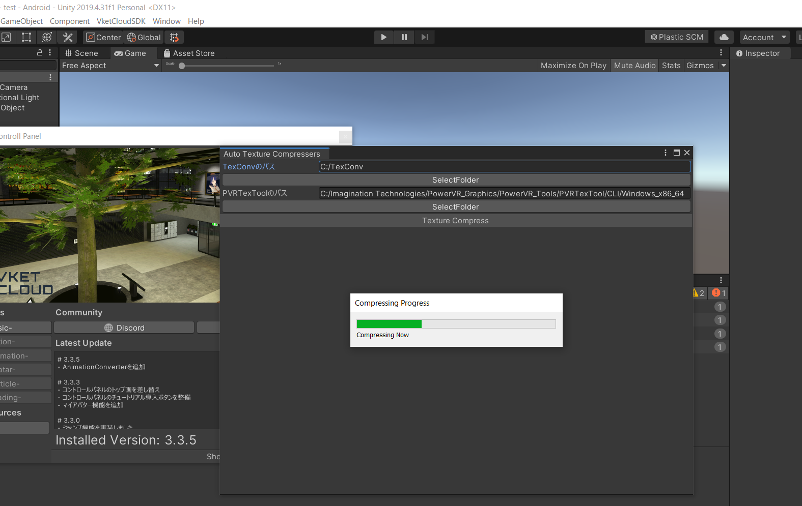

# Animation Converter 使い方
VketCloudでは、アニメーションはUnityでいうLegacyタイプのアニメーションを使用する必要があります。通常、Unity上でのHumanoidアニメーションからLegacyアニメーションへの変換は、ボーンの名前や構造の違いから、同一のキャラクターモデルでしか行うことはできません。Animation ConverterはキャラクターモデルAのHumanoidアニメーションをキャラクターモデルBのLegacyアニメーションに変換することができます。

## 使用方法
### 1. Animation Converterの選択
Windowツールバーの「VketCloud SDK」タブから、「Animation Converter」を選択する。

### 2. 変数の設定
アニメーション変換前に変数を設定する必要があります。それぞれの変数の意味は下記のとおりです。
・変換モデル…レガシーアニメーションを使用するキャラクターモデル。※この時点では、Humanoidアニメーションである必要があります。変換したのちに、Unity上でレガシータイプのRigに変換して、変換アニメーションを確認してください。
・変換対象のアニメーション…レガシーアニメーションに変換するヒューマノイドアニメーション
・ルート…キャラクターモデルのルートボーン。例えば、Vketちゃん2号の場合、キャラクターオブジェクトの直下には「Reference」があり、これがルートボーンになります。この子に「Hip」「Spine」などが続きます。もし、キャラクターモデルの直下に「Hip」ボーンの親となるボーンがある場合、ルートとして設定する必要があります。
・Save Folder…変換したアニメーションを保存するフォルダになります。「Select Save Folder」ボタンを押すと、保存先フォルダを指定することができます
※現在、変換モデルのRigにOptionalBoneである「UpperChest」が設定されている必要があります。

### 3. アニメーションの変換
全ての変数を設定し終わった後、Convert Animationボタンを押してください。
変換処理が数秒間行われ、終了後、変換されたアニメーションが指定のフォルダに入っています。

### 4. 確認テスト
試しに変換したアニメーションを再生してみましょう。まず、先ほど変換モデルに使用したキャラクターモデルをレガシーRigに変換し、変換したレガシーアニメーションを割り当ててください。
下記画像は、左のVketちゃんのHumanoidアニメーションをVketちゃん2号が使えるレガシーアニメーション向けに再変換したものを再生しました。うまく変換が行われていると、同じポーズが再生されるはずです

### 5. 制約
現在、Animation Converterはβ版です。下記の問題が確認されており、順次解決していく予定です。
Rootアニメーションを変換できない
指のアニメーションを変換できない
基本的な人体構造以外のアニメーションを変換できない
表情モーフを変換できない
その他のコンポーネントのアニメーション（オブジェクトのOnOffなど）を変換できない
変換処理における効率的なイテレーションによる変換速度の高速化
