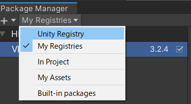
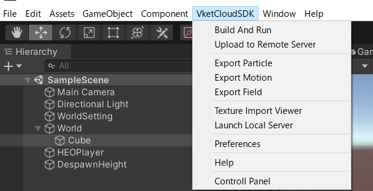

# **VketCloudSDKの導入方法**

UnityのPackage Managerを使用してインストールします。  
  
### Step 1. Unityでプロジェクトを開く  
---
対応しているバージョン（[Unity事前設定](https://vrhikky.github.io/VketCloudSDK_Documents/3.3/ja/Unity/OperatingEnvironment.html)）のプロジェクトを開く、またはプロジェクトを新規作成します。  
テンプレートは「3D」を選択してください。      
  
※[Unity事前設定](https://vrhikky.github.io/VketCloudSDK_Documents/3.3/ja/Unity/OperatingEnvironment.html)ページで事前設定を完了させてください。

※プロジェクト名にスペースを入れるとビルドに失敗する場合があります。  
OK例) MyProject　　NG例) My Project  
     

### Step 2. パッケージマネージャーの設定  
---
Unityのメニュー Edit > Project Settings から「Project Settings」ウィンドウを開きます。  
  
ウィンドウ内左のタブから「Package Manager」を選択し、以下のように記載します。  
  
|  項目  |  値  |
| ---- | ---- |
|  Name  |  VketCloudSDK  |
|  URL  |  https://registry.npmjs.com  |
|  Scope(s)  |  com.hikky.vketcloudsdk  |  

   
  最後に「Save」ボタンを押して設定内容を保存します。
    
  
  
### Step 3. Package ManagerからVketCloudSDKパッケージをインストール
---

  
Unityのメニュー Window > Package Manager から「Packages」ウィンドウを開きます。

ウィンドウ上部のドロップダウンより「My Registries」を選択します。

   

表示されたリスト内から VketCloudSDK を選択し、「Install」ボタンを押してインストールを開始します。  
  

Unityのメニューに「VketCloudSDK」の項目が追加されていれば導入は完了です。  

   

### Step 4. パスを登録
---

Unityのメニュー VketCloudSDK＞Preferences

「buildpassword」欄にパスワードを入力  
※パスワードは[マイページ](https://lab.vketcloud.com/mypage/sdk/)の「ビルドロックパスワード」に記載されています。

   

以上で導入は完了です。おつかれさまでした！  

